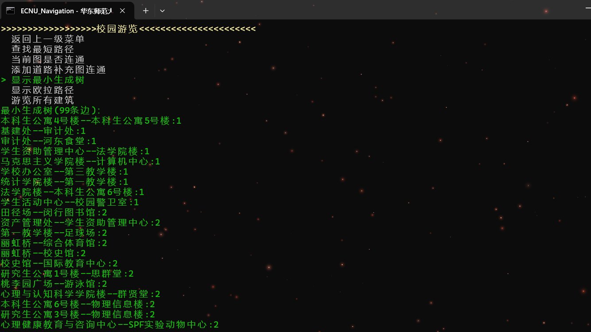

## 简介

一个简单的c++与python混合编程项目

## 说明

- 有命令行菜单(run_cmd.bat)和GUI界面(run.bat)两种，后者功能多一些。
- cases下是数据样例，要用哪个就把文件拷贝到主目录下
- 使用的python版本是**3.10.9**，确保系统的python3.10.9文件**已添加至系统环境变量**否则无法运行run.bat
- 运行run_cmd.bat之前要**改一下使用的g++和gcc路径**

## 展示

